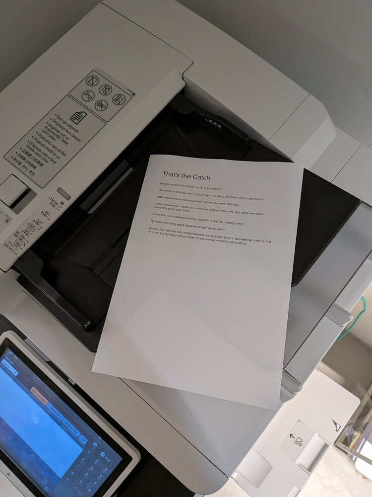
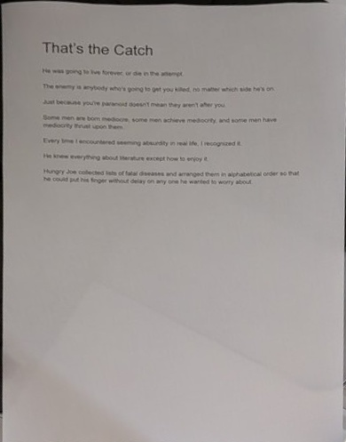
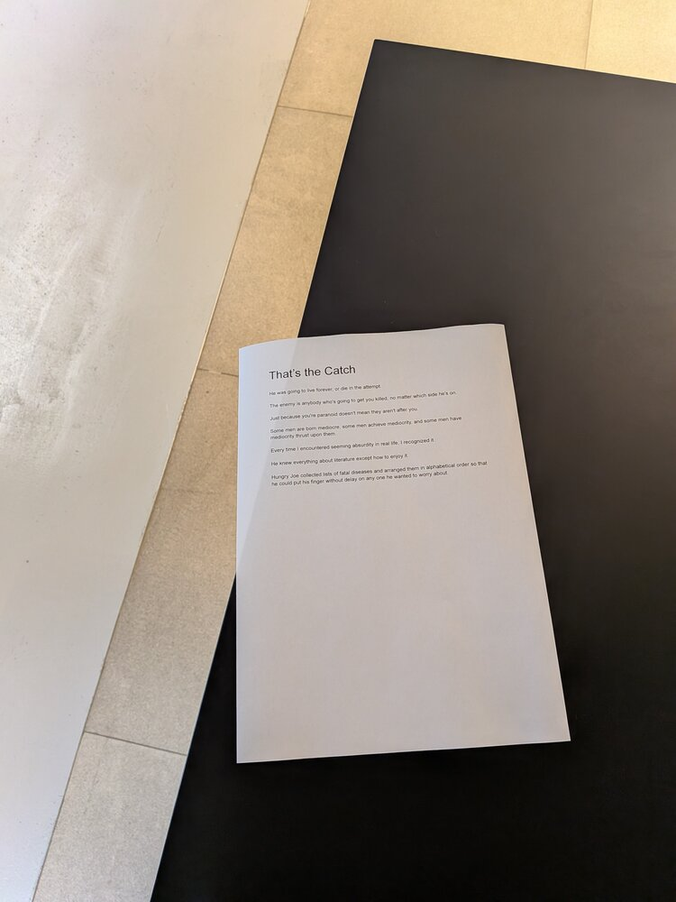
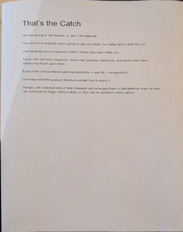
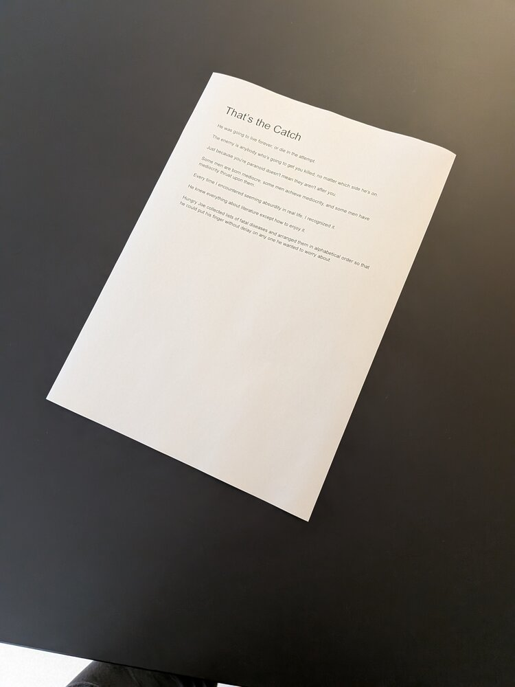
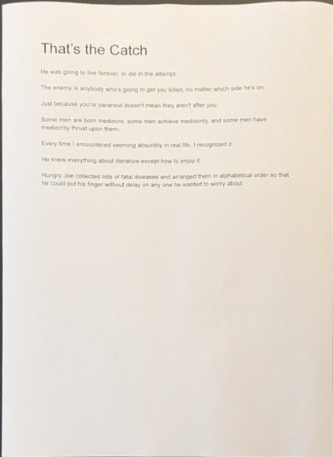
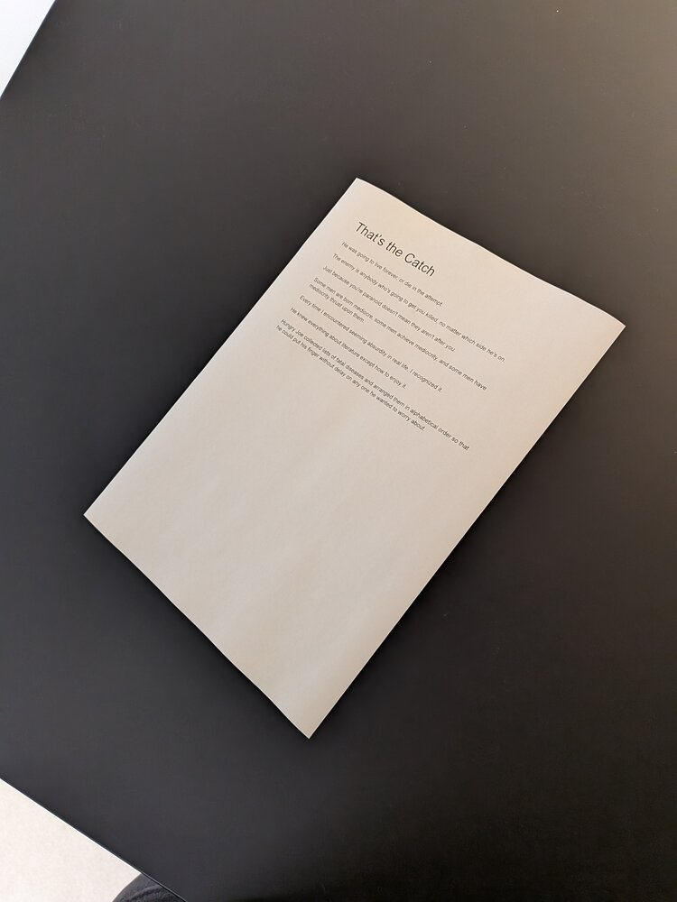
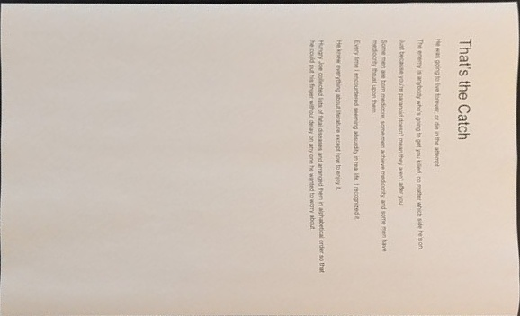

# Paperless Feeder

A mobile-first web app for processing document photos and uploading them to [Paperless-ngx](https://docs.paperless-ngx.com/) as multi-page documents.

Take photos of documents with your phone, and Paperless Feeder will automatically detect, crop, deskew, and straighten them — then upload the assembled PDF to your Paperless-ngx instance.

## Examples

| Input | Output |
|-------|--------|
|  |  |
|  |  |
|  |  |
|  |  |

## How it works

1. **Capture** — Take a photo or pick an image from your phone
2. **Detection** — [DocAligner](https://github.com/DocsaidLab/DocAligner) heatmap regression model locates the four document corners
3. **Perspective crop** — Warps the detected quadrilateral into a rectangle
4. **Deskew** — Hough-based skew correction straightens residual rotation
5. **Assemble** — Combine multiple pages into a single PDF
6. **Upload** — Send the PDF to Paperless-ngx via its API

## Stack

FastAPI, HTMX, Alpine.js, Tailwind CSS, Pillow (PDF assembly)

## Setup

Requires Python 3.12+.

```bash
cp .env.example .env
# Edit .env with your Paperless-ngx URL and API token
```

### Run locally (development)

```bash
uv sync
uv run uvicorn app.main:app --host 0.0.0.0 --port 8000 --reload
```

### Run with Docker

```bash
docker compose up -d --build
```

The app is available at http://localhost:8000.

## CLI (standalone)

The document processing pipeline can also be used directly:

```bash
uv run docprep photo.jpg output.jpg
uv run docprep photo.jpg output.jpg --debug debug/   # save intermediate images
```

## Project structure

```
app/                    # FastAPI web application
├── main.py             # App factory and router wiring
├── config.py           # Settings (Paperless URL/token)
├── sessions.py         # In-memory session management
├── processing.py       # scan_document wrapper
├── rendering.py        # HTMX partial HTML rendering
├── cleanup.py          # Session TTL cleanup
├── routes/             # API endpoints
│   ├── pages.py        # GET / (HTML shell)
│   ├── upload.py       # POST /upload
│   ├── process.py      # POST /process/{page_id}
│   ├── images.py       # GET /pages/{page_id}/image
│   ├── pages_mgmt.py   # DELETE/PUT page management
│   ├── assemble.py     # POST /assemble (PDF)
│   └── submit.py       # POST /submit (Paperless upload)
└── templates/
    └── index.html      # Single-page HTMX/Alpine UI

docprep/                # Document processing library
├── cli.py              # Click CLI entry point
├── scan.py             # Detection, perspective crop, orchestration
├── deskew.py           # Post-crop rotation correction
└── debug.py            # Pipeline visualization writer

tests/                  # pytest test suite (35 tests)
```

## Tests

```bash
uv run pytest tests/ -v
```
