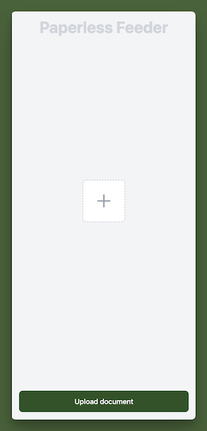
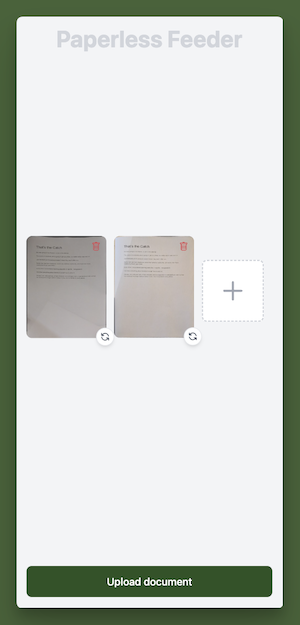
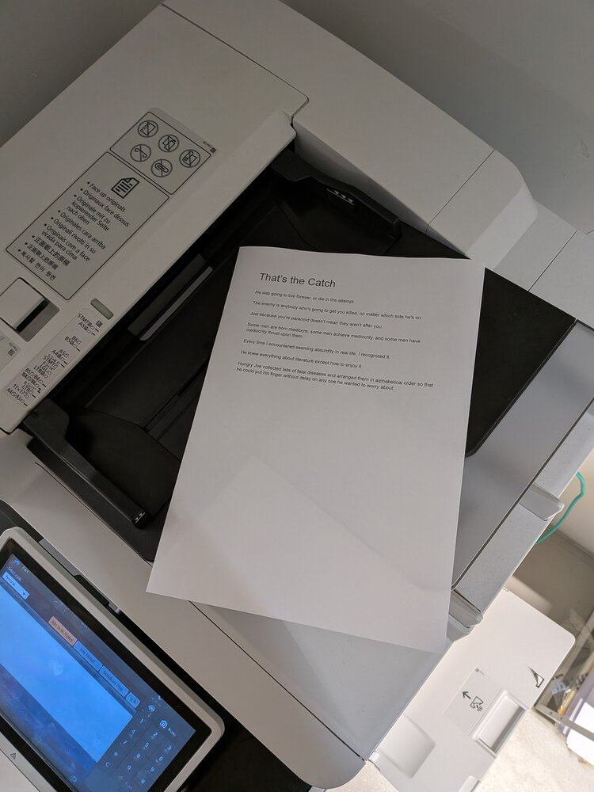
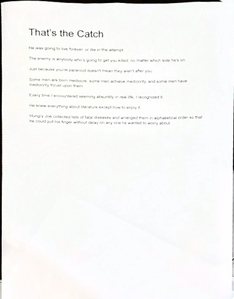
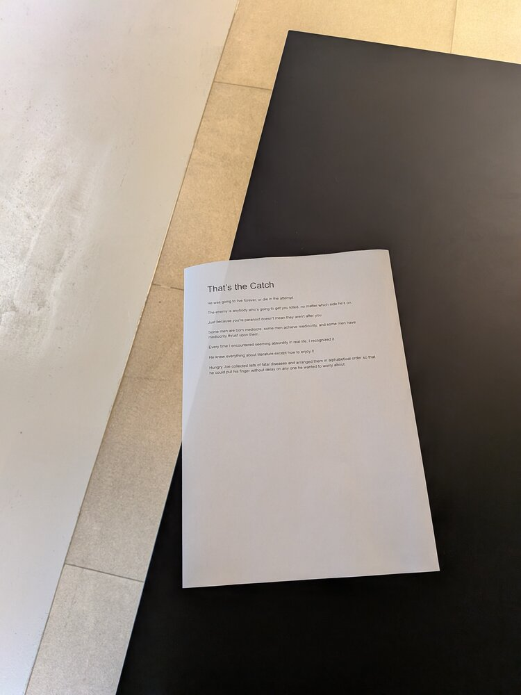
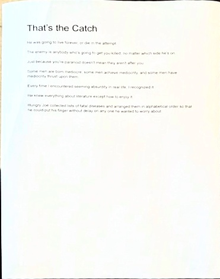
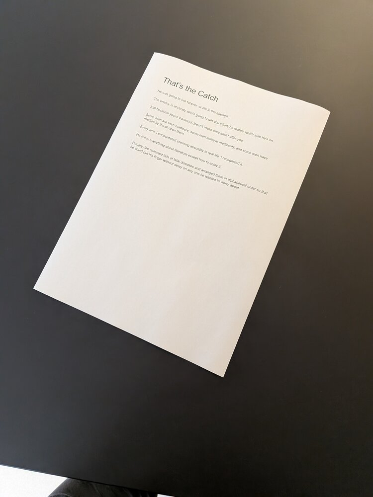
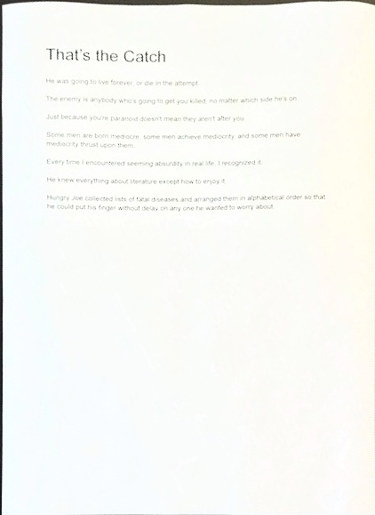
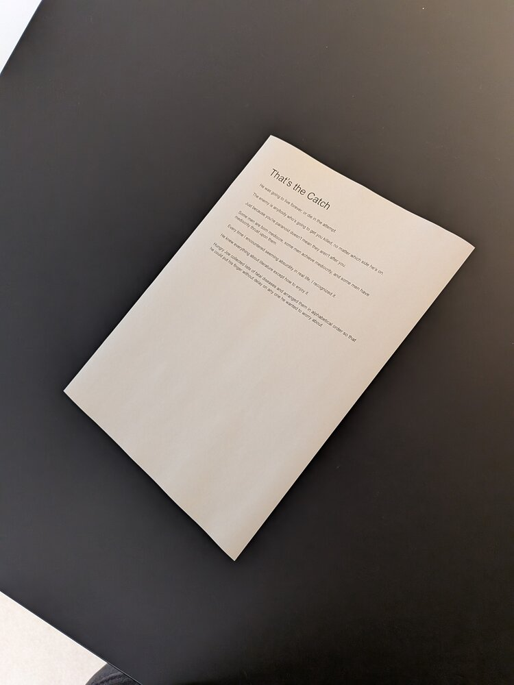

# Paperless Feeder

A mobile-first web app for processing document photos and uploading them to [Paperless-ngx](https://docs.paperless-ngx.com/) as multi-page documents.

Take photos of documents with your phone, and Paperless Feeder will automatically detect, crop, deskew, and straighten them — then upload the assembled PDF to your Paperless-ngx instance.

## Screenshots

| Empty state | With pages |
|:-----------:|:----------:|
|  |  |

## Examples

| Input | Output |
|-------|--------|
|  |  |
|  |  |
|  |  |
|  |  |

## How it works

1. **Capture** — Take a photo or pick an image from your phone
2. **Detection** — [DocAligner](https://github.com/DocsaidLab/DocAligner) heatmap regression model locates the four document corners
3. **Perspective crop** — Warps the detected quadrilateral into a rectangle
4. **Deskew** — Hough-based skew correction straightens residual rotation
5. **Tag** — Optionally attach one or more Paperless-ngx tags from a searchable popover
6. **Assemble** — Combine multiple pages into a single PDF
7. **Upload** — Send the PDF to Paperless-ngx via its API

## Stack

FastAPI, HTMX, Alpine.js, Tailwind CSS, Pillow (PDF assembly)

## Setup

Requires Python 3.12+.

```bash
cp .env.example .env
# Edit .env with your Paperless-ngx URL and API token
```

### Paperless-ngx permissions

The app uses a single API token for all requests. The user that owns the token
must be able to **view all tags** you want to pick from in the label selector,
otherwise the popover will only show the subset they can see.

Paperless-ngx filters `/api/tags/` by per-object view permission (via
django-guardian), so in a multi-user setup it is not enough for the user to
have the `documents.view_tag` model permission — each tag object must also
grant `view_tag` to that user (directly or via a group).

Recommended setup:

1. Create a dedicated Paperless user (e.g. `paperless-feeder`) and generate an
   API token for it — put the token in `PAPERLESS_TOKEN`.
2. Put that user in a shared group (e.g. `doc-editors`).
3. Make sure every tag you want visible is shared with that group
   (`view_tag` + `change_tag`). For existing tags, the quickest path is a PATCH
   per tag as an admin:

   ```bash
   curl -X PATCH -H "Authorization: Token <admin-token>" \
     -H "Content-Type: application/json" \
     "$PAPERLESS_URL/api/tags/<id>/" \
     -d '{"set_permissions":{"view":{"users":[],"groups":[<group-id>]},"change":{"users":[],"groups":[<group-id>]}}}'
   ```

4. To make new tags auto-share with the group, set **Default permissions** for
   new objects in the web UI (Settings → Permissions) of whichever user
   actually creates tags. Note that this is a client-side default applied by
   the web UI only — tags created by other API clients (e.g. paperless-gpt)
   will still need permissions granted separately.

The token only needs upload-capable permissions (`add_document`,
`view_document`, `view_tag`); it does not need to create or change tags.

### Run locally (development)

```bash
uv sync
uv run uvicorn app.main:app --host 0.0.0.0 --port 8000 --reload
```

### Run with Docker

```bash
docker compose up -d --build
```

The app is available at http://localhost:8000.

## CLI (standalone)

The document processing pipeline can also be used directly:

```bash
uv run docprep photo.jpg output.jpg
uv run docprep photo.jpg output.jpg --debug debug/   # save intermediate images
```

## Project structure

```
app/                    # FastAPI web application
├── main.py             # App factory and router wiring
├── config.py           # Settings (Paperless URL/token)
├── sessions.py         # In-memory session management
├── processing.py       # scan_document wrapper
├── rendering.py        # HTMX partial HTML rendering
├── cleanup.py          # Session TTL cleanup
├── routes/             # API endpoints
│   ├── pages.py        # GET / (HTML shell)
│   ├── upload.py       # POST /upload
│   ├── process.py      # POST /process/{page_id}
│   ├── images.py       # GET /pages/{page_id}/image
│   ├── pages_mgmt.py   # DELETE/PUT page management
│   ├── assemble.py     # POST /assemble (PDF)
│   ├── tags.py         # GET /tags (proxies Paperless tags, paginated)
│   └── submit.py       # POST /submit (Paperless upload, with tags)
└── templates/
    └── index.html      # Single-page HTMX/Alpine UI

docprep/                # Document processing library
├── cli.py              # Click CLI entry point
├── scan.py             # Detection, perspective crop, orchestration
├── deskew.py           # Post-crop rotation correction
└── debug.py            # Pipeline visualization writer

tests/                  # pytest test suite (35 tests)
```

## Tests

```bash
uv run pytest tests/ -v
```
